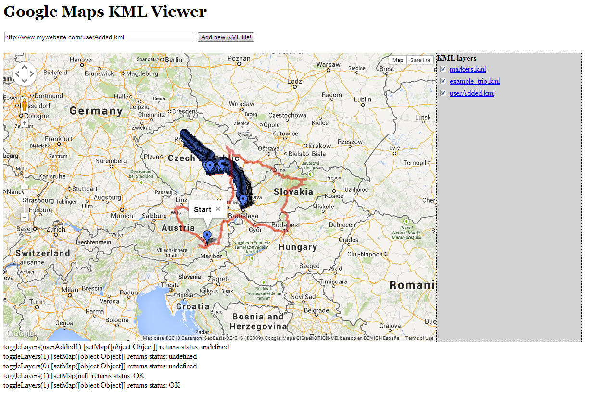

GoogleMaps KML viewer
=====================

PHP/JavaScript web application to automatically display KML files in a specific web folder and plot them on a Google Map.

Forking of GeoPHP project adding new features (e.g. KML files alphabetically ordered) and updating the system to the latest version of Google Maps JavaScript API.



### Features
This webpage allows you to automatically display on a Google Map the KML files you have inside the same folder on your website.
You can also temporarily add other external KML by inserting their URL (e.g. http://www.website.com/kmltest.kml).
These files will be shown on your webpage, but will be lost once you refresh it.

### License
Original [GeoPHP project] (https://code.google.com/p/geophp/) licensed under [Apache Licence 2.0](http://www.apache.org/licenses/LICENSE-2.0.html).

### Changelog
- First commit: Forked [GeoPHP project] (https://code.google.com/p/geophp/) and updated it from [Google Maps JavaScript API v2 (Deprecated)](https://developers.google.com/maps/documentation/javascript/v2/reference) to [Google Maps JavaScript API v3](https://developers.google.com/maps/documentation/javascript/)
- 28/08/2013: KML files displayed in alphabetical order by default 

### USAGE
 - Simply copy index.php file along with all your KML files into the same web folder
 - Open your browser and go to the index.php file on your web server (e.g. www.mywebsite.com/mymaps/index.php)
 - See following section if you have troubles

### Troubleshooting
#### Map is not shown
If you do not see the map, look at the Javascript Console (F12 to open it) and check if you get the following error:
`Google Maps API error: MissingKeyMapError https://developers.google.com/maps/documentation/javascript/error-messages#missing-key-map-error`
In that case, you need to get an API key (cfr. https://developers.google.com/maps/documentation/javascript/get-api-key) and add it as shown in step2 in https://developers.google.com/maps/documentation/javascript/get-api-key at line https://github.com/micheledallatorre/GoogleMaps_KML_viewer/blob/master/index.php#L57

#### KML file is not shown
Check the it does not exceed any limit, see https://developers.google.com/maps/documentation/javascript/kmllayer#restrictions

If for example the KML is bigger than 3 MBs, it will not be shown.
In that case you can convert it (cfr. https://www.techwalla.com/articles/how-to-convert-kml-to-kmz) to a kmz file, basically by zipping it and changing the extension of the file from zip to kmz.
Then change line https://github.com/micheledallatorre/GoogleMaps_KML_viewer/blob/master/index.php#L84 accordingly, e.g. as follows:
```
					if ($extension == ".kml" || $extension == ".kmz")
```     


__TODO__
- [ ] add options to order KML layers by name, size, etc. (maybe via a sortable JQuery table)
